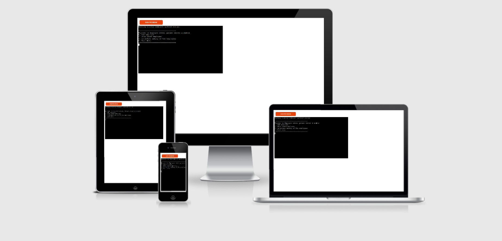

# EmployeeAdd
EmployeeAdd is a terminal program that runs on Heroku and is created with Python. In this case the users are employeers that want a structed way of adding information about their employees to a informationlist. To keep track of the economy the employer can also caluculate all the salaries that have been added to the informationlist. The employeers will be able to add four type of information about their employees, Employee-id,salary,name and country. The employeers will also have an option where they can see all the employees that have been added to the list.

# User stories
* As a business owner i would like a program where I can calculate the salaries of my employees every month.

* I would like a structured way of adding information such as, ID-number,name,age,country and salaries to database/spreadsheet.

* I want to be able retrive the information that I have stored about my employees.

# Features
There will be 4 options to choose from.

## 1. AddEmployee
* The user will be asked to input 4 types of information. Add employee Id, salary,name and country. After pressing enter on the last information input a message will display informing and confirming that the information have been added successfully and also displaying what the user have added to the list. The program will then shutdown and update the sheet and the user have to start the program again.

 

* We can see here that the spreadsheet also have been automatically updated with the   same information that the users just inputted byt the user.

* 

## 2. Show added employee
* This option will show all the employees that have been adde to the spreadsheet, if we take the one we just added as an example we can see that it returns the same information as the spreadsheet. I have also added another employee to the spreadsheet to just to show that it will return all information from the spreadsheet.The program will still run even after the user have pressed number 2 and the user will be presented with the choiches again from the main menu as you can see below the displayed user information.

* 

## 3. Calculate salary

* This option will call the spreadsheet "salary" row and it will return the sum of all the numbers that have been inputted by the user. We can see in the picture that the returned sum is "37322" when the users press 3.

 

* If we look in the spreadsheet data in the "Salary row" we can se that the returned sum is the same as the terminal program.

* 

## 0. Exit menu
* This option will shutdown the program and will display a message to inform the user that the program is exiting.

## Future features
 * Allow the user to sort the names by alphabetical order.

  

