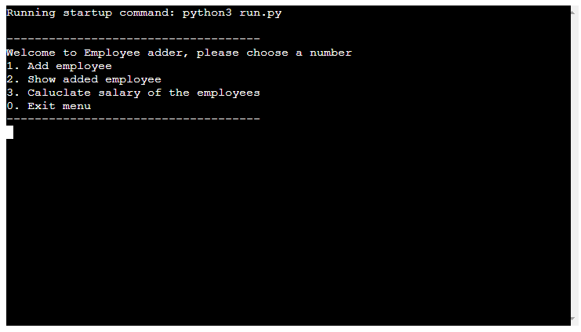
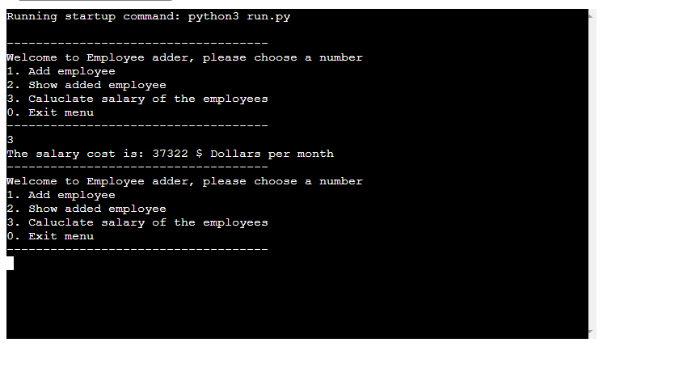

# EmployeeAdd
EmployeeAdd is a terminal program that runs on Heroku and is created with Python. In this case the users are employeers that want a structed way of adding information about their employees to a informationlist. To keep track of the economy the employer can also caluculate all the salaries that have been added to the informationlist. The employeers will be able to add four type of information about their employees, Employee-id,salary,name and country. The employeers will also have an option where they can see all the employees that have been added to the list.

# User stories
* As a business owner i would like a program where I can calculate the salaries of my employees every month.

* I would like a structured way of adding information such as, ID-number,name,age,country and salaries to database/spreadsheet.

* I want to be able retrive the information that I have stored about my employees.

# Features
There will be 4 options to choose from.

## 1. AddEmployee
* The user will be asked to input 4 types of information. Add employee Id, salary,name and country. After pressing enter on the last information input a message will display informing and confirming that the information have been added successfully and also displaying what the user have added to the list. The program will then shutdown and update the sheet and the user have to start the program again.

 

* We can see here that the spreadsheet also have been automatically updated with the   same information that the users just inputted byt the user.

* 

## 2. Show added employee
* This option will show all the employees that have been adde to the spreadsheet, if we take the one we just added as an example we can see that it returns the same information as the spreadsheet. I have also added another employee to the spreadsheet to just to show that it will return all information from the spreadsheet.The program will still run even after the user have pressed number 2 and the user will be presented with the choiches again from the main menu as you can see below the displayed user information.

* 

## 3. Calculate salary

* This option will call the spreadsheet "salary" row and it will return the sum of all the numbers that have been inputted by the user. We can see in the picture that the returned sum is "37322" when the users press 3.

 

* If we look in the spreadsheet data in the "Salary row" we can se that the returned sum is the same as the terminal program.

* 

## 0. Exit menu
* This option will shutdown the program and will display a message to inform the user that the program is exiting.

## Future features
 * Allow the user to sort the names by alphabetical order.

 * Allot the user to calculate the yearly cost of the employee salries

  

# Testing
 I have tested the program by doing the following.

 * My code was tested with the PIP8 validator.

 * Tested the code in Heroku.

 * Tested the code in Github terminal.

 # Bugs

 ## Solved bugs
 * Sometimes when I wrote the input information the spreadsheet would place the information wrong and return the wrong data like the picture below. You can see when I tried to add the 6th person the information got wrong and would go outside the rows.  
 

* As you can se below the data on column "E" to "H" that is outside the headlines with "employe, salary,name,contry" would not display in the terminal because it was outside column "A" to "D".
 

* When the user inputted 1 on the menu the user would be able to add an employee to the sheet. and the program would loop untill 0 is pressed. That was the problem I discovered, so to solve this bug, i had to break the loop after the user had inputted the information about the employees. I put a break in the loop and finally the program worked like I had planned from the start.

# Unsolved Bugs
 * No known bugs

# Validation of code

* Code passed the [Pep8Validator](http://pep8online.com/checkresult) with no errors.  

# Depoyment
 This project was deployed on Heroku. With the help of Github.

 Github.
 * Use the template for python provided by Code institute.

 * In the Github terminal type "pip3 freeze > requirments.txt

 * Go to the requirements.txt and copy the installed text.

 * Type "pip3 install gspread google-auth" in Github terminal to install the library used for this project.

 Heroku
 * Create a new app on Heroku.
 
 * Go to settings.

 * Click on "config vars".

 * On "Key" add the name of your json file with capital letters. In this case "CREDS"
 
 * In the value field Paste the contents from the requirements.txt that you copied from Github earlier.

 * Also add PORT as another key and the value of:8000

 * Scroll down to "buildpacks",add python and nodejs, make sure that python is the first on the list.

 * Go to "Deploy" and link your Github repository with Heroku.

 * Scroll down and click on "Deploy branch".
 
# Credits
* The deployment terminal was used from Code institutes template: [Codeinstitute template](https://github.com/Code-Institute-Org/python-essentials-template).

* The API connection code to Google spreadsheet was taken from Code insitutes "Love Sandwich project".

